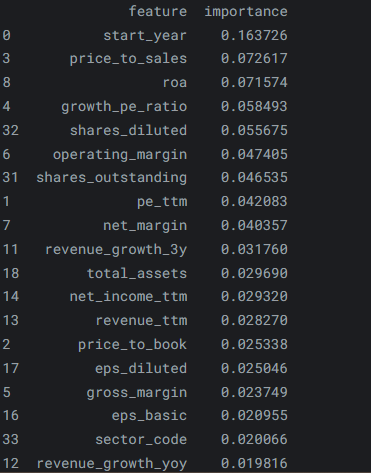
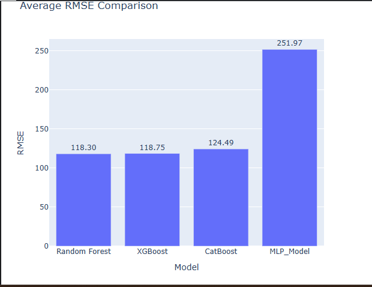

# 📈 Predict 1-Year US Stock Returns from Fundamentals

### Project Links

- Kaggle Notebook: https://www.kaggle.com/code/sumeakash/predict-1-year-us-stock-returns-from-fundamentals

- 🔗 [LinkedIn Profile](https://www.linkedin.com/in/akash-kumar-barnwal-31968a380/)

- 💻 [GitHub Profile](https://github.com/barnwalakash60973-pixel)

## Project Overview

This project aims to predict one-year stock returns using company fundamental data such as valuation ratios, profitability metrics, growth indicators, liquidity measures, and dividend-related features.


---


## Dataset Overview

This dataset is from a Kaggle competition focused on predicting one-year U.S. stock returns using company fundamental data.

* Training Data: 23,000+ observations
* Test Data: 23,000+ observations
* Training Features: 39 columns
* Test Features: 34 columns
* Target Variable: `return_pct`

Features include:

* Valuation Metrics (P/E, Price-to-Book, Price-to-Sales)
* Profitability Metrics (ROE, ROA, Net Margin)
* Growth Metrics (Revenue Growth)
* Liquidity Metrics (Current Ratio, Quick Ratio)
* Debt Metrics (Debt-to-Equity)
* Dividend Information

---

## Project Workflow

### 1. Exploratory Data Analysis (EDA)

* Dataset Overview
* Missing Value Analysis
* Target Variable Analysis
* Correlation Analysis
* Outlier Detection
* Distribution Analysis

### 2. Data Preprocessing

* Missing Value Imputation
* Missing Indicator Features
* Data Quality Checks


 ### Validation Strategy

A 5-Fold TimeSeriesSplit cross-validation strategy was used to ensure that future observations were never used to predict past observations, preventing data leakage.
    

### 3. Model Building

The following models were evaluated:

* Random Forest Regressor
* XGBoost Regressor
* CatBoost Regressor
* Deep Learning Models (TabNet and Multi-Layer Perceptron)

### 4. Model Evaluation

Evaluation Metrics:

* MAE (Mean Absolute Error)
* RMSE (Root Mean Squared Error)
* R² Score

Models were evaluated using 5-Fold TimeSeriesSplit Cross Validation.

---

## Key Business Insights

### Missing Values

Many companies do not pay dividends, especially growth-oriented firms. Therefore, missing values in dividend-related features may contain useful information rather than indicating poor data quality.

### Correlation Analysis

No single financial metric strongly explains future stock returns. This suggests that stock performance is influenced by multiple interacting factors.

### Model Insights

Tree-based ensemble models were more effective at capturing complex non-linear relationships between company fundamentals and future stock returns.

---

### Prediction Challenges

Stock returns vary significantly across different time periods, making future return prediction challenging. This limits the predictive power of models based solely on financial fundamentals.

---


### Feature Importance Insights



The most important features were start_year, valuation ratios, profitability metrics, and growth indicators. This suggests that future stock returns depend on both company fundamentals and changing market conditions.

---

## Results


* Multiple machine learning models were compared using cross-validation.

* Tree-based ensemble models achieved the best performance.

* Predicting one-year stock returns remains challenging due to the noisy and non-stationary nature of financial markets.

---

## Model Performance Comparison




Tree-based ensemble models achieved the best performance, with Random Forest and XGBoost producing the lowest RMSE scores. CatBoost delivered comparable results, while the Deep Learning MLP model significantly underperformed. These findings suggest that traditional ensemble methods are better suited for this tabular financial dataset than neural network-based approaches.


## Technologies Used

* Python
* Pandas
* NumPy
* Scikit-Learn
* XGBoost
* CatBoost
* TensorFlow / Keras
* Plotly
* Matplotlib
* Seaborn
---

## Repository Structure

```text
├── notebook
│   └── notebook.ipynb
├── images
│   ├── feature_importance.png
│   └── model_comparison.png
├── README.md
└── requirements.txt
```


---

## Future Improvements

* Advanced Feature Engineering
* SHAP Explainability
* Hyperparameter Optimization
* Additional Market-Based Features

---

## Conclusion

This project explored the challenge of predicting one-year stock returns using company fundamentals. While machine learning models were able to capture some predictive patterns, the results highlight the difficulty of forecasting financial markets due to their noisy and non-stationary nature. Tree-based ensemble models delivered the most reliable performance and outperformed deep learning approaches on this structured tabular dataset.

---

## Key Learnings

* Company fundamentals explain only a limited portion of future stock returns, highlighting the difficulty of forecasting financial markets.

* Stock returns are highly noisy and non-stationary, with return distributions changing significantly across different time periods.

* Tree-based ensemble models (CatBoost and XGBoost) outperformed deep learning models on this tabular financial dataset.

* Proper time-series cross-validation is essential to prevent data leakage and obtain reliable performance estimates.

* Missing values can contain useful business information, particularly for dividend-related features where non-reporting may reflect company characteristics rather than poor data quality.


## Author

Akash Kumar Barnwal
